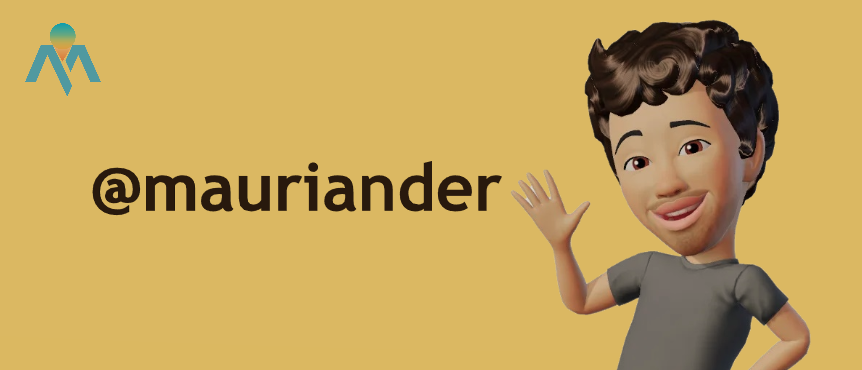

<!--
**mauriander/mauriander** is a ✨ _special_ ✨ repository because its `README.md` (this file) appears on your GitHub profile.

Here are some ideas to get you started:

- 🔭 I’m currently working on ...
- 🌱 I’m currently learning ...
- 👯 I’m looking to collaborate on ...
- 🤔 I’m looking for help with ...
- 💬 Ask me about ...
- 📫 How to reach me: ...
- 😄 Pronouns: ...
- ⚡ Fun fact: ...
&bg_color=100,5b4f51,fffff9&title_color=fff&text_color=fff
-->

 <!--
 <h2 align="center">Profile</h2>

 
 <h2 align="center">Profile</h2>

-->

### Hi there 👋 I'm [Mauricio Andermatten](https://maurianderc51.000webhostapp.com/index.html)
> Fullstack & QA Tester

 

I am Web developer able to build a Web presence from the ground up - from concept, navigation, layout and programming. Skilled at writing well-designed, testable and efficient code using current best practices in Web development. Fast learner, hard worker and team player who is proficient in an array of scripting languages and multimedia Web tools.

I have excellent design & coding skills, as well as an ability to convert requirements into exciting online applications.

### Programming Languages 🌐

  - - -  - -  

### Framworks 
-

 
### Tools 🛠️

### Github Stats

### Top Langs

<h3> 🤝🏻 Connect with Me </h3>

